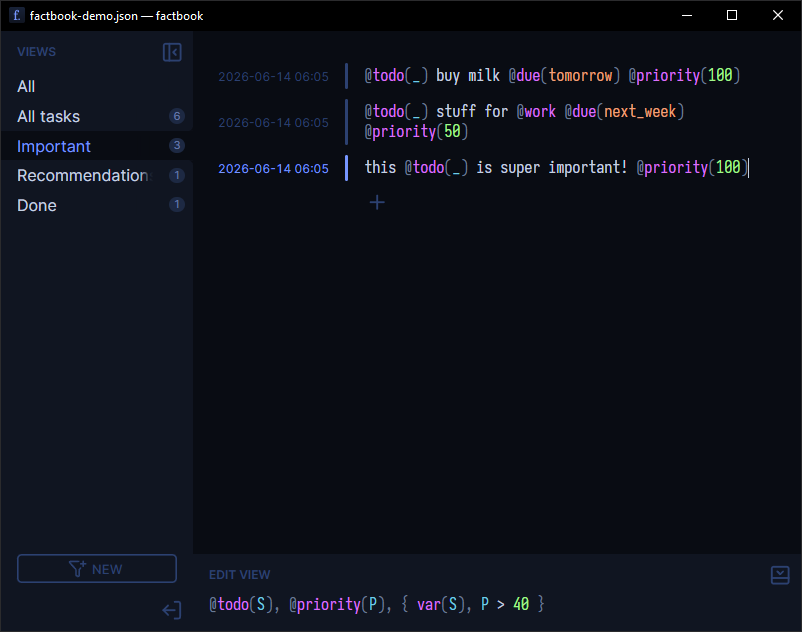

Programmer-friendly personal knowledge base in the vein of Zettelkasten based on logic programming

**factbook** is a note-taking app for persisting and organizing text-based knowledge. Its philosophy borrows from the Zettelkasten methodology, extending it with powerful logic programming capabilities. With [SWI Prolog](https://www.swi-prolog.org) at its core it delivers a user-facing full-featured Turing-complete programming language with excellent relational capabilities.

> [!WARNING]
> This is a work in progress. Expect random crashes and general instability. It is also currently possible to execute arbitrary Prolog code from within the application ([#24](https://github.com/michalwa/factbook/issues/24)).

<p align="center">
  <picture>
    <source media="(prefers-color-scheme: light)" srcset="screenshot-light.png">
    
  </picture>
</p>

## Philosophy

1. **Zero friction:** Dump _anything_ into your knowledge base at any time, without any distraction with organization. No need to think about which directory an entry belongs to. Write first, organize second.
2. **Atomic knowledge:** Every thought is its own entity, allowing for powerful "just-in-time" organization. Gain a completely new perspective on your notes by simply adjusting your queries. Entries have no enforced structure, they are simple text. Don't worry about coming up with titles or formatting paragraphs.
3. **Fluently embedded data:** All organization is done via parseable tags embedded in entries. Tagging entries is as simple as typing an `@` and a term, no need to do any meta-organization anywhere else. Easily express data you want to keep track of, create ontologies on the fly. Tags become part of your language, seamlessly scattered throughout your text where needed. They can be atomic or hold nested data, just like Prolog terms.

   ```css
   walk the dog @todo @due(tomorrow) @priority(10) @cite("Einstein", 1905)
   ```

4. **Powerful queries:** Easily define _views_ into your knowledge base by querying facts about entries&mdash;presence of tags, timestamps, relations between entries&mdash;or even executing custom code. This is where organization happens. Do it whenever you need to, at your own pace, outside of the flow of taking notes, and get all the [power of Prolog](https://www.metalevel.at/prolog) to your advantage.

   <!-- TODO: The example should ideally use existing predicates once they are implemented -->

   ```prolog
   % Example only, specific available predicates and semantics may differ
   %
   % This would yield entries containing `@todo` and `@due(_)` with an argument
   % describing a time in the past, i.e. overdue tasks

   { now(N) },                     % get current timestamp
   @todo,                          % filter entries with `@todo` tag
   @due(D),                        % filter entries with `@due(_)` tag and take the argument D
   created(D0),                    % get the entry creation time D0
   {
     relative_datetime(D0, D, D1), % specify D1 as the threshold timestamp
     D1 < N                        % compare with current timestamp
   }
   ```

## Running

See [Github releases](https://github.com/michalwa/factbook/releases) for pre-built binaries.

## Development

**factbook** is built with Rust + [Tauri](https://v2.tauri.app) + [Solid](https://www.solidjs.com) + SWI Prolog

Unfortunately, SWI Prolog provides several challenges in terms of development experience:
- It does not provide pre-built static libraries, and the custom build process for some platforms like Windows is complicated and unreliable. This means we are forced to link and ship the shared version of the library.
- Most installations do not place the shared library in a system-default path discoverable by runtime linking. This means we need special tooling to help with locating the library in development and embed custom `rpath` entries into the release binaries.

Details of dealing with this are described below.

### Prerequisites

Automated scripts for installing system dependencies are provided: `setup.sh` and `setup.ps1`, but may not support all platforms and package managers.

- Rust v1.88+ (nightly is only required for `cargo fmt`)
- Node.js with pnpm (install with `npm i -g pnpm`)
- [Tauri system prerequisites](https://v2.tauri.app/start/prerequisites)
- SWI-Prolog 10.0.2 or newer with a compatible C API. Common compilation errors result from mismatched SWI-Prolog versions. Platform-specific instructions are described below.

#### SWI-Prolog on Mac/Linux/MinGW

Install using a package manager, then verify the installation:

```shell
pkg-config --modversion swipl
```

More often than not, the shared library `libswipl.so.10` is placed in a location missing from `LD_LIBRARY_PATH`. The project uses a [suite of crates](https://github.com/terminusdb-labs/swipl-rs/tree/master/swipl-fli) to help with the general awkwardness of linking against `libswipl`. `swipl-info` finds `libswipl` at build time and solves compile-time linking, but does not provide a way to embed the library path into executables. This means you may need to proxy some `cargo` commands via `cargo-swipl`:

```shell
cargo install cargo-swipl
cargo swipl test  # Run tests ensuring libswipl is found
```

Alternatively, manually find and add the appropriate path to `LD_LIBRARY_PATH`.

#### SWI-Prolog on Windows (MSVC)

Either:

- [Download](https://www.swi-prolog.org/Download.html) and install manually. Make sure to check one of the _Add to PATH_ boxes during installation.
- Run `setup.ps1` and set the `SWIPL` environment variable to an absolute path pointing at `libs/swipl/bin/swipl.exe`.

### Building and running

Run the project in development:

```
pnpm tauri dev
```

Make and run the release build:

```
pnpm tauri build --no-bundle
target/release/factbook
```

Make and run the debug build:

```
pnpm tauri build --debug --no-bundle
target/debug/factbook
```

Generating proper portable bundles requires importing shared libraries into the `libs` directory. Consult `setup.sh` or `setup.ps1` for details. Remove the `--no-bundle` flag if you want to produce bundles locally.

### Style

Format the codebase:

```
pnpm format
cargo +nightly fmt
```
