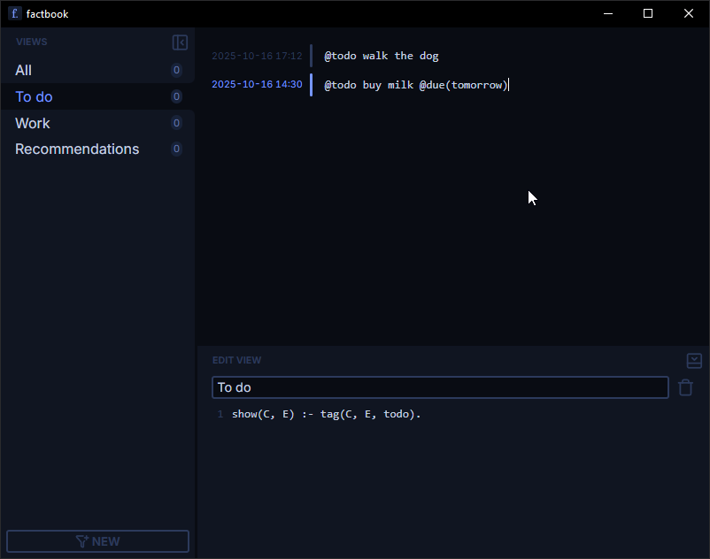

Programmer-friendly personal knowledge base based on logic programming

> [!WARNING]
> This is a work in progress

<p align="center">
  
</p>

## Philosophy

1. **Quick inbox** &ndash; Dump _anything_ into your knowledge base at any time, without any friction of organization. No need to think about which directory an entry belongs to. Write first, organize second.
2. **Atomic entries** &ndash; Every thought is its own entity, allowing for powerful organization. Gain a completely new perspective on your notes simply by adjusting your queries. Entries have no enforced structure, only text. Don't worry about coming up with titles or formatting paragraphs.
3. **Atomic tags** &ndash; All organization is done via parseable tags embedded in entries. Tagging entries is as simple as typing an `@` and a term, no need to do any meta-organization anywhere else. Easily express data you want to keep track of, create ontologies on the fly. Tags become part of your language. They can be atomic or hold nested data, just like Prolog terms. You are not forced to tag your entries, and if you do, they live seamlessly scattered throughout your text.

   ```css
   walk the dog @todo @due(tomorrow) @priority(10)
   ```

4. **Powerful views** (aka. queries) &ndash; Easily define views into your knowledge base by querying facts about entries&mdash;presence of tags, timestamps, relations between entries, and more... This is where organization happens. You do it at your own pace, outside of the flow of taking notes. And you get all the [power of Prolog](https://www.metalevel.at/prolog) to your advantage.

   <!-- TODO: The example should ideally use existing predicates once they are implemented -->
   ```prolog
   % Example only, specific available predicates and semantics may differ
   % 
   % This would yield entries containing `@todo` and `@due(_)` with an argument
   % describing a time in the past, i.e. overdue tasks
   
   { now(N) },                     % get current timestamp
   @todo,                          % filter entries with `@todo` tag
   @due(D),                        % filter entries with `@due(_)` tag and take the argument D
   created(D0),                    % get the entry creation time D0
   {
     relative_datetime(D0, D, D1), % specify D1 as the threshold timestamp
     D1 < N                        % compare with current timestamp
   }
   ```

## Development

### Prerequisites

- Rust v1.88+
- Node.js with pnpm (install with `npm i -g pnpm`)
- [Tauri system prerequisites](https://v2.tauri.app/start/prerequisites)
- SWI-Prolog 10.0.2 or newer with a compatible C API. Install using a system package manager or [download](https://www.swi-prolog.org/Download.html) and install manually.
  - On Mac/Linux/MinGW verify the installation with `pkg-config --modversion swipl`
  - On Windows (MSVC) add the following to your `~/.cargo/config.toml`:
    ```toml
    # `rustdocflags` is only needed for running some doc tests
    [build]
    rustdocflags = [
        "-Clink-arg=/LIBPATH:C:\\Program Files\\swipl\\bin"
    ]

    [target.x86_64-pc-windows-msvc]
    rustflags = [
        "-Clink-arg=/LIBPATH:C:\\Program Files\\swipl\\bin"
    ]
    ```

### Running in development

Run the entire Tauri project with `pnpm tauri dev`

Run the release build with:

```
pnpm tauri build
target/release/factbook
```
